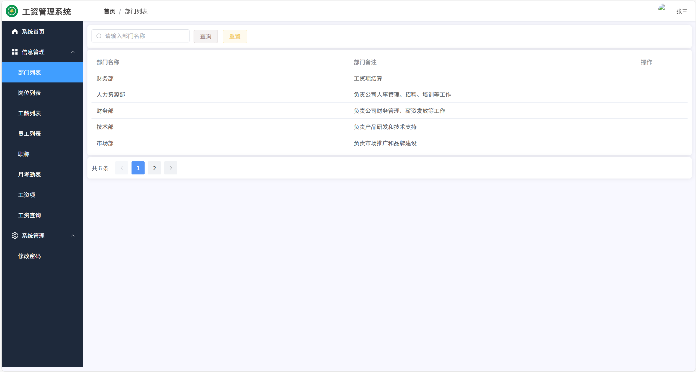
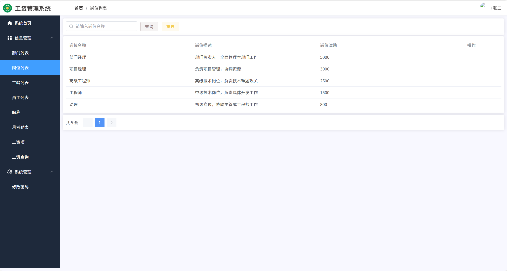
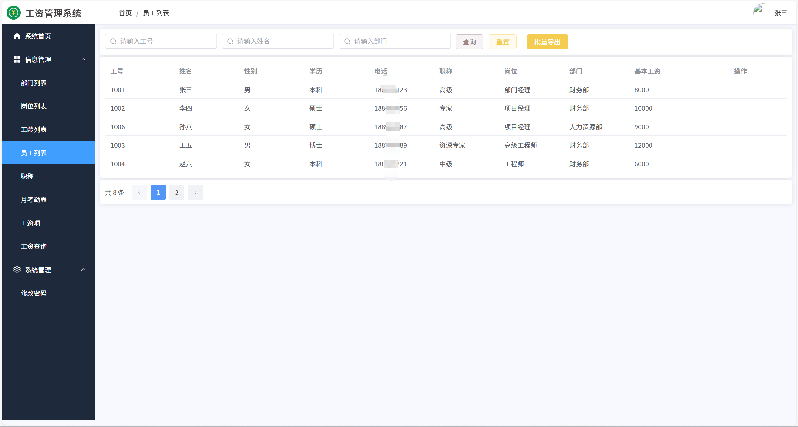
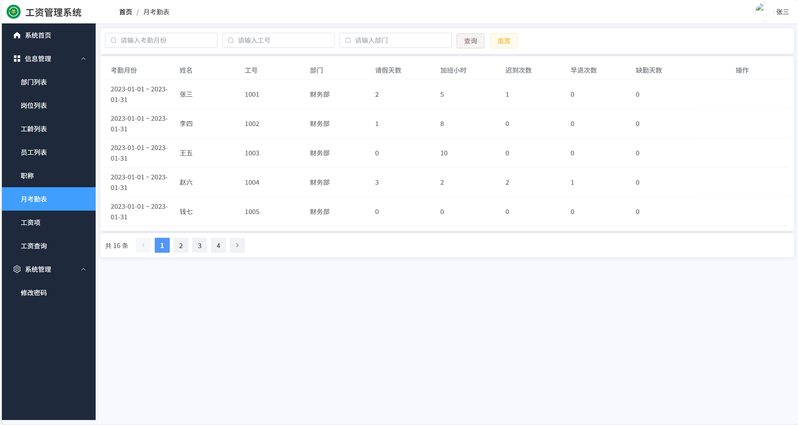
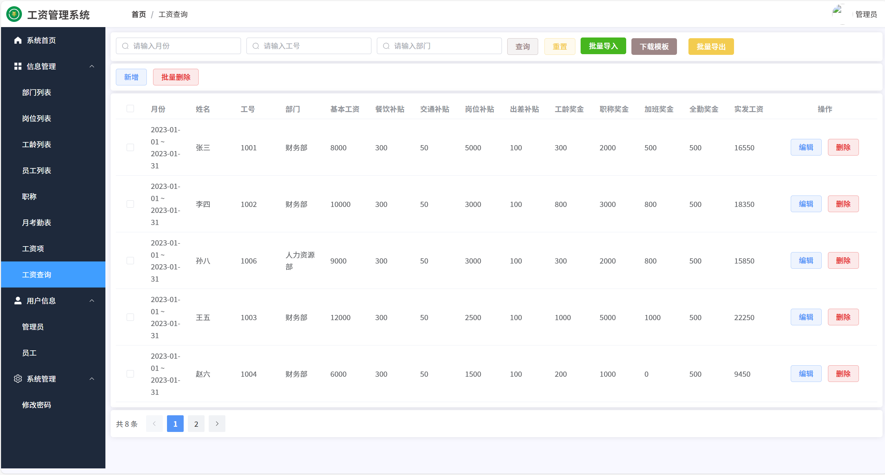
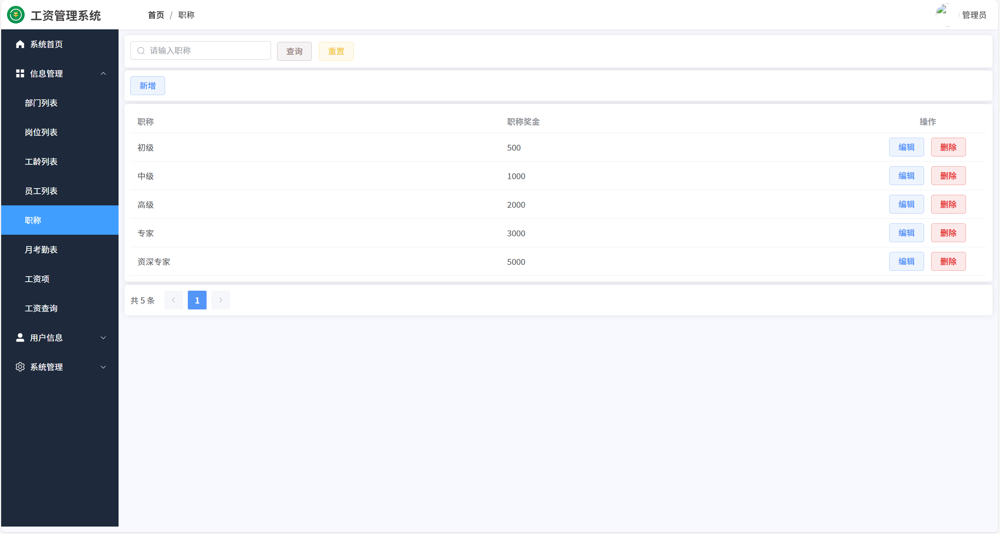
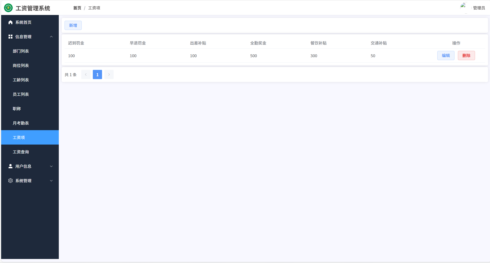
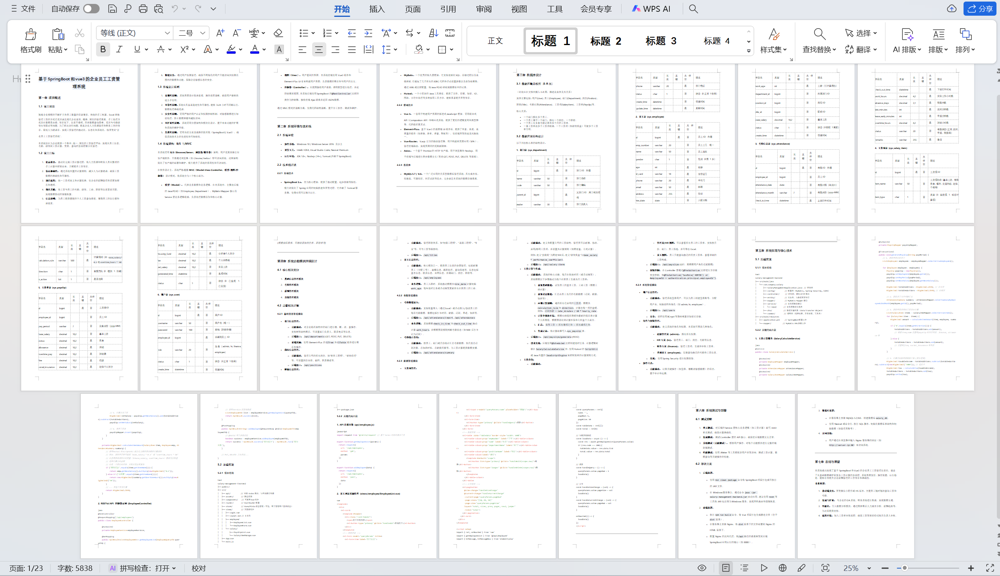

# springbootA545
springbootA545员工工资管理系统（Vue3）
 
## 源码问题查看主页咨询

### 一、关键词
员工工资管理系统，职工薪资管理系统，企业工资管理系统

### 二、作品包含
源码+数据库+设计文档+全套环境和工具资源+本地部署教程

### 三、项目技术
前端技术：Html、Css、Js、Vue3.0、Element-plus
后端技术：Java、SpringBoot3.0、MyBatis

### 四、运行环境（以下版本亲测，其他版本兼容性请自行测试）
开发工具：IDEA/eclipse  + VSCODE

数据库：MySQL5.7（最低要5.7版本）

数据库管理工具：Navicat10以上版本

环境配置软件： JDK17 + Maven3.6.3

前端Nodejs：20

浏览器：谷歌浏览器

### 五、项目介绍
项目编号：springbootA545

员工工资管理系统可自动化完成工资核算、发放、个税申报及数据统计分析，规范薪资管理流程并提升效率。
该工资管理系统具有以下功能：
部门列表功能：可查询、管理公司各部门信息，包括部门名称和备注。
岗位列表功能：能查询、管理各岗位信息，涵盖岗位名称、描述及津贴。
员工列表功能：可查询、管理员工信息，包含工号、姓名、性别、学历、电话、职称、岗位、部门、基本工资等，并支持批量导出。
月考勤表功能：用于查询、管理员工月度考勤，涉及考勤月份、姓名、工号、部门、请假天数、加班小时、迟到次数、早退次数、缺勤天数等。
工资查询功能：可查询、管理员工工资，包含月份、姓名、工号、部门、基本工资、各项补贴、奖金及实发工资，支持新增、批量删除、批量导入、下载模板、批量导出等操作。
职称管理功能：用于管理职称及对应的职称奖金，支持新增、编辑、删除。
工资项管理功能：管理迟到罚金、早退罚金、出差补贴、全勤奖金、餐饮补贴、交通补贴等工资相关项目，支持新增、编辑、删除。
系统管理功能：可修改密码，还有用户信息（管理员、员工）管理及系统设置等相关功能。

### 六、运行截图

 
